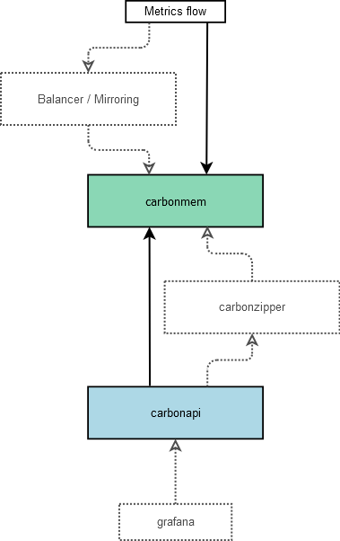

carbonmem: memory-backed carbon store
=================================================

<a href="https://packagecloud.io/"></a>

Optimized to answer to topK kind of queries.

Other pieces of the stack are:
   - [carbonapi](https://github.com/go-graphite/carbonapi)
   - [carbonzipper](https://github.com/go-graphite/carbonzipper)
   - [carbonsearch](https://github.com/kanatohodets/carbonsearch)

For an overview of the stack and how the pieces fit together, watch
[Graphite@Scale or How to store millions metrics per second](https://fosdem.org/2017/schedule/event/graphite_at_scale/)
from FOSDEM '17.

Changes and versioning
----------------------

Version policy - all the versions we run in production is taged.

In case change will require simultanious upgrade of different components, it will be stated in Upgrading notes below.

Also we will try to maintain backward compatibility from down to up.

For example with protobuf2 -> protobuf3 migration - carbonzipper can still send results to older versions of carbonapi, but can't get results from older versions of carbonserver/go-carbon.

See [CHANGES.md](https://github.com/go-graphite/carbonmem/blob/master/CHANGES.md)


Work scheme
-----------



Gray components are optional or alternative


Build
-----

Required golang 1.7+

```sh
# build binary
git clone https://github.com/go-graphite/carbonmem.git
cd carbonmem
make dep
make
```


Usage
-----

The service accept only following types of requests:

```toml
path.to.your.metrics.for.top.*.TopK.10m
```

The asterisk must be in metrics path. Usage of asterisk at any node of the tree are permitted.


Acknowledgement
---------------
This program was originally developed for Booking.com.  With approval
from Booking.com, the code was generalised and published as Open Source
on github, for which the author would like to express his gratitude.

License
-------

This code is licensed under the MIT license.


Contact
-------

If you have questions or problems there are two ways to contact us:

1. Open issue on a github page
2. #zipperstack on [gophers slack](https://invite.slack.golangbridge.org/)
